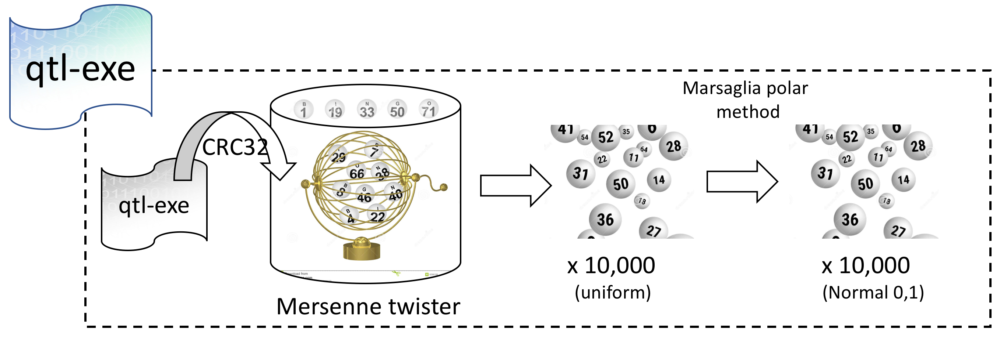

# qtl-exe

## why
Now that the sequence of the human genome is old news, maybe the next fundamental challenge of genomics is to characterize the function of every one of the 3-billion-odd nucleotides in the genome. Hopefully, the magnitude of this task will provide me with some job security. There are lots of sophisticated ways to indirectly measure what some piece of the DNA does: RNA-seq to see whether it's transcribed, methylation assays to see if there's chromatin marks, ChIP-seq to see if proteins like to hang out there, etc. The ENCODE consortium produced an impressive amount of these assays, stimulating valuable insights and a slew of controversies. A direct (albeit not as sophisticated) method harkens back to the early days of genetic manipulation: make some directed mutations and see what happens! All that to say, don't write off old-fashioned knockout experiments just because we can sequence ALL THE THINGS now.

Some time ago, intrepid microbiologists created mutant yeast with every different gene of the species' ~6000 completely deleted. (Giaever G et al. in _Nature_, 2002) They tried to culture every mutant and recorded whether it grew or not (this isn't really a quantitative trait, more on that shortly). Only 19% of gene knockouts weren't viable! It's important to note that they tested growth in ideal conditions (yummy glucose and a balmy 30 degrees), so this provides no evidence for the function (or lack thereof) for the other 81% of genes. Another 15% had slower growth.  

A later study did 6 million assays to barrage these mutants with environmental and chemical perturbations. This work found that 97% of mutants had affected growth in some condition. (Hillenmeyer et al. in _Science_, 2008). That makes more sense, perhaps. You'd expect all of the genes to be useful for something, even if it's only obvious in an obscure or extreme condition.  

It was a substantial project just to make a few thousand deletion mutants; imagine generating (for yeast) 12 million single-base-pair deletions, or 36 million single-base-pair swaps! It's comparatively trivial to write a little program with a simple output and do an exhaustive enumeration of its mutations. And for you, it's even easier because I already wrote the source code and scripts. Here you go!  

It's less trivial to figure out what, if anything, this analogy means in terms of the mutation-robustness of genomes. Take a look at `report/` for some of my thoughts.

## what

A QTL, or [quantitative trait locus](https://en.wikipedia.org/wiki/Quantitative_trait_locus), is a region on the genome that is associated with some characteristic of the individual that is measured by a real number; think height or weight. There can be more than one QTL associated with a characteristic; likewise, QTLs may not be the only contributor to the value of a trait in some individual.  

The program computes the [CRC32](https://en.wikipedia.org/wiki/Cyclic_redundancy_check) checksum of itself and uses this to seed a pseudo-random number generator. It's a 32-bit implementation of the [Mersenne twister](https://en.wikipedia.org/wiki/Mersenne_Twister). (The constants are #define'd macros.) The pRNG gives numbers in a Uniform distribution from 0 to 4294967295. The [Marsaglia polar method](https://en.wikipedia.org/wiki/Marsaglia_polar_method) is used to simply transform these numbers into samples from a standard Normal distribution (zero mean, unit variance). It keeps the implementation's reliance on external functions fairly simple because it uses natural log and square root instead of trigonometric functions and Pi. All 10,000 numbers are printed to stdout, so you'd better be prepared to catch them!  

Imagine these random numbers are an individual. We can measure all sorts of characteristics of him: hey look, quantitative traits! I looked at mean, standard deviation, skew, and the Jarque-Bera test for normality.  

Some of the scripts in `/scripts` mutate the program at every bit, run the program, and calculate statistics on the output or record which runtime error code sent the program to an early grave. For qtl-exe, about 9000 bytes, this exhaustive enumeration took 3 hours on my machine. 
Depending on compiler options, only 16-25% of programs have a runtime error! From a pessimistic angle, the expected value of the number of mutations it takes to find a lethal one is 4 to 6. I don't know whether this should be surprising or not.  

## who and where
Charlotte Darby, Johns Hopkins University  
Term project for EN.600.649: Computational Genomics: Applied Comparative Genomics, Spring 2017